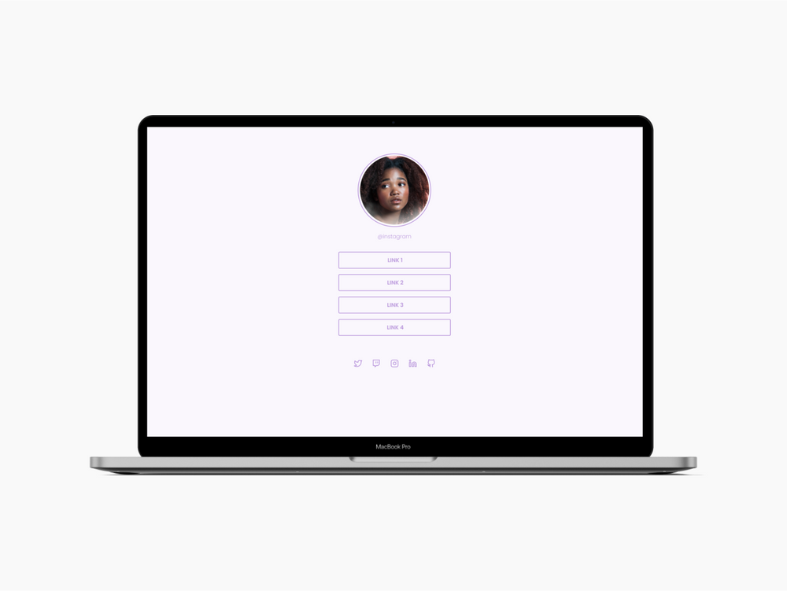

<h1>Desafio "Social Tree"</h1>

Neste desafio criei uma página com uma lista de links que pode ser usada em perfins de redes socais.

<h3>Layout do porjeto</h3>

<h3>🚀 Techs</h3>
<ul>
    <li> HTML
    <li> CSS
</ul>

<h3>Requisitos para desafio</h3>
<ul>
    <li> Adicionar uma imagem de perfil.
    <li> Adicionar uma lista de links que possa ser usada para enviar o usuário para outros sites.
    <li> Centralizar os conteúdos usando conceitos de flexbox.
</ul>

